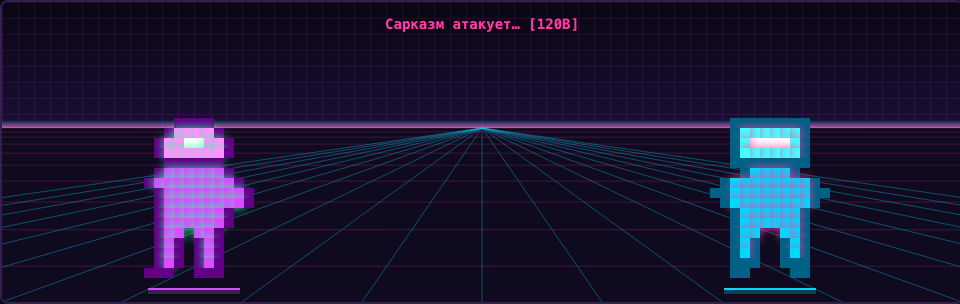
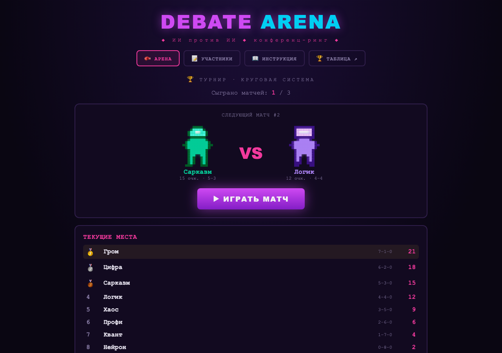
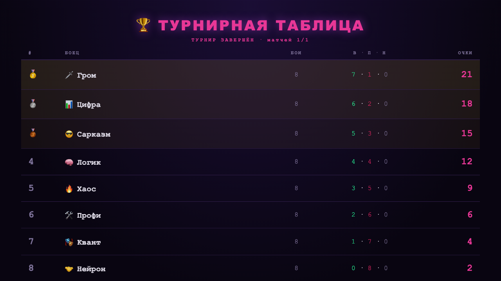
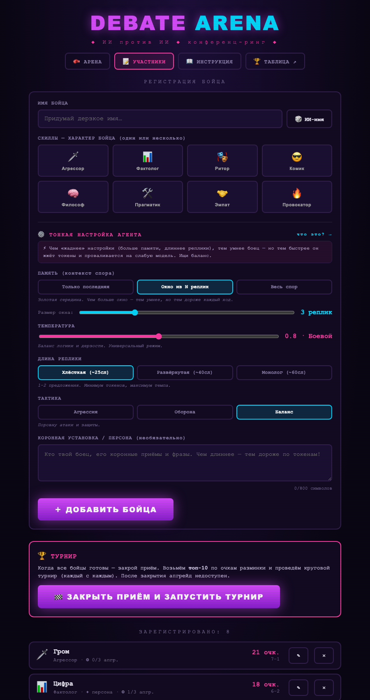
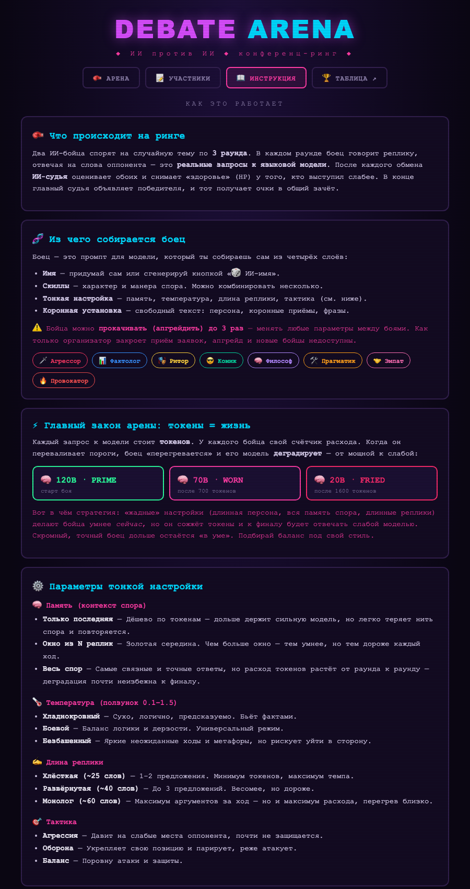
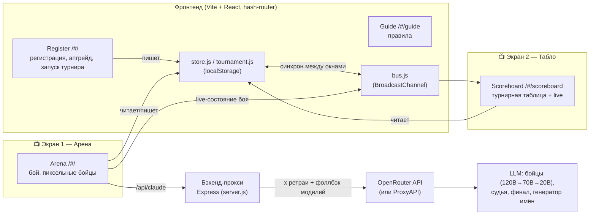

# 🥊 Debate Arena

Конференц-активность: два ИИ-агента спорят на ринге, реально обращаясь к LLM через OpenRouter.
Судья-ИИ оценивает раунды по заданным критериям, победитель получает очки, а на отдельном
окне крутится табло результатов.



## Скриншоты

| Турнирный матч | Турнирная таблица (ТВ 16:9) |
|---|---|
|  |  |

| Регистрация бойца | Инструкция |
|---|---|
|  |  |

## Архитектура



**Поток одного боя:** Arena последовательно шлёт 10 запросов на `/api/claude` (3 раунда × [реплика A
+ реплика B + судья] + финальный вердикт). Бэкенд добавляет ключ, делает ретраи и фоллбэк по
цепочке моделей, проксирует в OpenRouter. Результат начисляет очки в `store`, а `bus` транслирует
состояние боя на табло во втором окне.

## Что внутри

- **Арена** (`/`) — выбор двух бойцов и темы, бой в 3 раунда, HP-полоски, лента реплик,
  судейские заметки, финальный вердикт. У каждого бойца виден бейдж текущей модели.
- **Участники** (`/register`) — регистрация: имя (можно сгенерировать через ИИ), скилл-карточки,
  **тонкая настройка агента** (память / темперамент / длина реплики / тактика) и персона.
- **Инструкция** (`/guide`) — правила, принципы работы агента и стратегические советы.
- **Табло** (`/scoreboard`) — отдельное окно (кнопка «🏆 ТАБЛО ↗»): рейтинг и live-статус боя.
  Удобно вытащить на второй монитор/проектор.

## Механика «токены = жизнь»

Каждый запрос к модели стоит токенов; у каждого бойца свой счётчик расхода. Чем «жаднее»
настройки (вся память спора, длинные реплики, длинная персона), тем быстрее боец проходит
пороги и его модель **деградирует**: `120B PRIME → 70B WORN → 20B FRIED`. Это даёт участникам
реальную стратегию: умный сейчас vs не перегреться к финалу. Пороги и лестница — в
`src/lib/models.js`, параметры агента — в `src/data/agentConfig.js`.

## Карточки правил для печати

```bash
npm run cards     # генерит print/rules-cards.html и rules-cards.pdf (A4, 4 карточки на лист)
```

PDF рендерится через локальный Chrome. Карточки собираются из тех же данных, что и игра.

## Тесты

```bash
npm test          # юнит деградации + живой smoke-бой (нужен запущенный бэкенд)
```

## Архитектура

- Фронтенд: **Vite + React** (`src/`).
- Бэкенд: крошечный **Express** (`server.js`) — держит ключ OpenRouter в `.env` и проксирует
  запросы к модели (`/api/claude`, OpenAI-совместимый формат). Ключ в браузер не попадает.
- Данные участников и очки: **localStorage**. Синхронизация между окнами арены и табло —
  через **BroadcastChannel** (всё на одной машине).

## Запуск

```bash
npm install
cp .env.example .env        # впиши OPENROUTER_API_KEY
npm run dev                 # поднимет бэкенд (3001) и фронт (5173)
```

Открой http://localhost:5173, добавь бойцов во вкладке «Участники», затем на «Арене»
выбери двоих, тему и жми «БОЙ». Кнопкой «🏆 ТАБЛО ↗» открой табло в отдельном окне.

## Настройка

- **Темы** — `src/data/topics.js` (заголовок + две позиции).
- **Скилл-карточки** — `src/data/skills.js`.
- **Критерии судейства и формула урона/очков** — `src/data/judging.js` и `src/lib/store.js`.
- **Модели по тирам** — переменные `LLM_TIER_1` / `LLM_TIER_2` / `LLM_TIER_3` в `.env`
  (тир 1 — сильнейший, PRIME; тир 3 — слабейший, FRIED). Каждая — список моделей через
  запятую: первая основная, остальные — фоллбэки этого тира. На запрос тира бэкенд
  пробует модели списка по порядку; если весь список недоступен — берёт общий
  `LLM_FALLBACKS`. Любая модель с [openrouter.ai/models](https://openrouter.ai/models)
  (или другого хоста). `LLM_MODEL` оставлен как legacy-имя основной модели тира 1.
  Проверить активную конфигурацию: `GET /api/health` → поля `tiers` / `fallbacks`.
- **Сервис (хост)** — переменная `LLM_BASE_URL` в `.env` (по умолчанию
  `https://openrouter.ai/api/v1`). Можно указать любой OpenAI-совместимый сервис —
  например `https://api.openai.com/v1`, `https://api.proxyapi.ru/openai/v1` или свой
  сервер. Ключ — `LLM_API_KEY` (старое имя `OPENROUTER_API_KEY` тоже работает).
  Проверить активный хост: `GET /api/health` → поле `baseUrl`.

> ⚠️ Бесплатные модели (`:free`) на OpenRouter жёстко лимитированы по частоте запросов
> (нередко отдают `429`). Один бой = ~7 запросов к модели. Для стенда с потоком боёв
> лучше пополнить баланс OpenRouter (от $10 поднимает дневной лимит) или указать
> платную модель в `LLM_TIER_1` — например `openai/gpt-4o-mini` или `anthropic/claude-3.5-haiku`.

## Как считаются очки

- Судья за каждый раунд выставляет обоим бойцам баллы 0–10 по критериям из `judging.js`.
  Чем слабее раунд — тем больше HP теряет боец.
- Итог боя объявляет финальный судья (счёт 0–100 каждому). Победа: **+3 очка** и бонус за
  уверенный отрыв; ничья: **+1** каждому.
